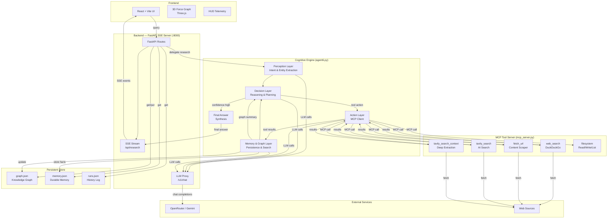
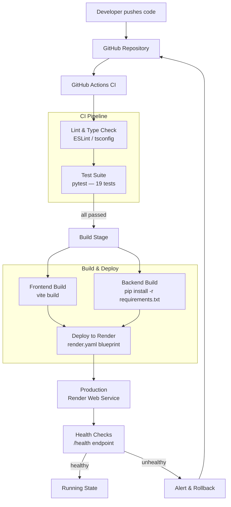

# NeuroWeave — Autonomous Knowledge Graph Cognitive OS


---

## Table of Contents

- [Project Overview](#project-overview)
- [Features](#features)
- [Installation](#installation)
- [Quick Start](#quick-start)
- [Usage](#usage)
- [Architecture Diagram](#architecture-diagram)
- [Workflow Diagram](#workflow-diagram)
- [Configuration](#configuration)
- [Testing](#testing)
- [Contributing](#contributing)
- [License](#license)
- [Contact / Support](#contact--support)
- [Generated by AI](#generated-by-ai)

---

## Project Overview

NeuroWeave is an autonomous, layered cognitive operating system designed to transform unstructured web evidence into a structured, persistent knowledge graph. The system runs a closed perception‑decision‑action‑memory loop, continuously refining its internal world model until a high‑confidence answer is reached. Each research session streams real‑time telemetry to a futuristic frontend, providing full transparency into the agent's reasoning chain, tool usage, and confidence scoring. Built for developers, researchers, and AI enthusiasts, NeuroWeave bridges the gap between raw web content and machine‑readable, queryable intelligence.

---

## Features

- **Four‑Layer Cognitive Pipeline** — Perception (intent analysis), Decision (reasoning & planning), Action (MCP tool execution), Memory & Graph (entity/fact extraction with confidence scoring).
- **Persistent Knowledge Graph** — Entities and relations are stored across runs, enabling cross‑session reasoning and cumulative intelligence.
- **Server‑Sent Events (SSE) Streaming** — Real‑time telemetry pushes each cognitive phase directly to the frontend as it happens.
- **Multi‑Provider LLM Proxy** — Routes requests through OpenRouter (primary) with automatic fallback to Google Gemini.
- **MCP Tool Ecosystem** — Built‑in tools for web search (DuckDuckGo, Tavily AI Search), URL content fetching, and filesystem operations, all exposed via the Model Context Protocol.
- **3D Force‑Directed Graph Visualization** — Frontend renders the knowledge graph with interactive WebGL nodes, particle animations, and edge highlighting.
- **Cinematic HUD Dashboard** — Dark‑theme glassmorphism UI with neon cyan accents, real‑time confidence gauge, and per‑phase color‑coded telemetry logs.
- **Run History & State Management** — Every research session is logged; full state can be reset with a single API call.
- **One‑Command Deploy via Render Blueprint** — Pre‑configured `render.yaml` for instant cloud deployment with environment variable syncing.

---

## Installation

### Prerequisites

- **Python 3.11+** with [uv](https://docs.astral.sh/uv/) package manager
- **Node.js 20+** with `npm`
- **LLM Gateway V3** running on `http://localhost:8101` (or alternate endpoint set in `.env`)

### Step 1: Clone the Repository

```bash
git clone https://github.com/<YOUR_ORG>/NeuroWeave.git
cd NeuroWeave
```

### Step 2: Configure Environment Variables

```bash
cp backend/.env.example backend/.env
```

Edit `backend/.env` with your API keys. At minimum you need one of the following:

| Variable | Required | Description |
|---|---|---|
| `OPENROUTER_API_KEY` | Yes | OpenRouter API key for LLM routing |
| `GEMINI_API_KEY` | Fallback | Google Gemini API key (used when OpenRouter fails) |
| `TAVILY_API_KEY` | Optional | Tavily AI Search API key for enhanced web search |
| `LLM_GATEWAY_V3_URL` | No | Defaults to `http://localhost:8101` |

### Step 3: Install Backend Dependencies

```bash
cd backend
uv sync
```

### Step 4: Install Frontend Dependencies

```bash
cd frontend
npm install
```

---

## Quick Start

Run all three components in separate terminals:

```bash
# Terminal 1 — Backend (FastAPI on :8000)
cd backend
uv run uvicorn app.main:app --reload --port 8000

# Terminal 2 — Frontend (Vite on :5173)
cd frontend
npm run dev
```

Open **http://localhost:5173** in your browser, type a research query, and watch the cognitive pipeline stream in real time.

> **Note:** An LLM Gateway (OpenRouter proxy) must be reachable at the URL specified in `LLM_GATEWAY_V3_URL`. The backend includes an embedded LLM proxy at `/v1/chat` that can serve as the gateway when run standalone.

---

## Usage

### API Endpoints

| Endpoint | Method | Description |
|---|---|---|
| `/api/research` | POST (SSE) | Submit a natural language query; streams cognitive telemetry |
| `/api/graph` | GET | Retrieve the current knowledge graph (nodes + links) |
| `/api/memory` | GET | Fetch durable memory records |
| `/api/history` | GET | View run‑by‑run history |
| `/api/reset` | POST | Wipe all persistent state (graph, memory, history) |
| `/api/status` | GET | Health check |
| `/health` | GET | Detailed health check with provider key status |
| `/v1/chat` | POST | LLM proxy endpoint (routes to OpenRouter / Gemini) |

### Example: Submit a Research Query

```bash
curl -X POST "http://localhost:8000/api/research" \
  -H "Content-Type: application/json" \
  -d '{"query": "What are the latest advancements in solid-state batteries?"}'
```

The response is a Server‑Sent Events stream. Each event contains a `phase` field (`perception`, `decision`, `action`, `memory`, `complete`, or `error`) and a `payload` with structured data for that phase.

### Example: Retrieve the Knowledge Graph

```bash
curl "http://localhost:8000/api/graph" | jq .
```

Returns a JSON object with `nodes` (id, type, label, confidence) and `links` (source, target, relation, confidence) ready for D3‑force visualization.

---

## Architecture Diagram



---

## Workflow Diagram



---

## Configuration

NeuroWeave is configured via environment variables. Copy `backend/.env.example` to `backend/.env` and populate as needed:

| Variable | Default | Required | Description |
|---|---|---|---|
| `OPENROUTER_API_KEY` | — | Yes (or Gemini) | OpenRouter API key |
| `OPEN_ROUTER_API_KEY` | — | Alt. spelling | Alternate key name for OpenRouter |
| `GEMINI_API_KEY` | — | Fallback | Google Gemini API key |
| `GOOGLE_AI_API_KEY` | — | Alt. spelling | Alternate key name for Gemini |
| `ROUTER_MERCURY_API_KEY` | — | Optional | Mercury router API key |
| `TAVILY_API_KEY` | — | Optional | Tavily AI Search API key |
| `LLM_GATEWAY_V3_URL` | `http://localhost:8101` | No | URL of the LLM gateway service |
| `PORT` | `8000` | No | Backend server port |
| `PYTHON_VERSION` | `3.11.0` | No | Python runtime version (Render) |

The backend automatically detects API keys on startup and logs their availability (masked). If OpenRouter is unavailable, requests fall through to Gemini transparently.

---

## Testing

Run the full backend test suite with a single command:

```bash
cd backend
uv run pytest tests/test_agent.py -v
```

Expected output: **19 tests passed**

The test suite covers the cognitive pipeline end‑to‑end, including perception analysis, decision planning, MCP tool execution, memory extraction, and graph persistence. Tests use mocked LLM responses to ensure deterministic, fast execution.

---

## Contributing

Contributions are welcome and appreciated. To contribute:

1. **Fork** the repository.
2. **Create a feature branch**: `git checkout -b feat/my-feature`.
3. **Commit your changes**: `git commit -m 'feat: add my feature'`.
4. **Push to the branch**: `git push origin feat/my-feature`.
5. **Open a Pull Request** against the `main` branch.

Please ensure:
- All existing tests pass (`uv run pytest tests/ -v`).
- New features include corresponding tests.
- Code follows the existing style (ESLint for frontend, Ruff/PEP 8 for backend).
- Commit messages follow [Conventional Commits](https://www.conventionalcommits.org/).

---

## License

Licensed under the **Apache License, Version 2.0**. You may obtain a copy of the License at:

[https://www.apache.org/licenses/LICENSE-2.0](https://www.apache.org/licenses/LICENSE-2.0)

Unless required by applicable law or agreed to in writing, software distributed under the License is distributed on an "AS IS" BASIS, WITHOUT WARRANTIES OR CONDITIONS OF ANY KIND, either express or implied. See the License for the specific language governing permissions and limitations under the License.

---

## Contact / Support

- **GitHub Issues**: [https://github.com/SairajMN/NeuroWeave/issues](https://github.com/SairajMN/NeuroWeave/issues)
- **Project Repository**: [https://github.com/SairajMN/NeuroWeave](https://github.com/SairajMN/NeuroWeave)

For questions, feature requests, or bug reports, please open an issue on GitHub. We aim to respond within 48 hours.

---

## Generated by AI

This README was generated with assistance from an AI language model (Claude) as part of an automated documentation pipeline. The content has been reviewed and verified against the project source code for accuracy.