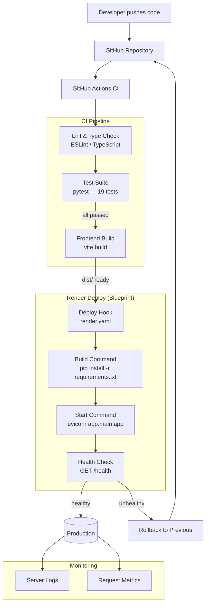
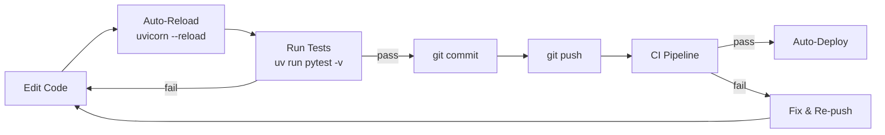

# NeuroWeave — Autonomous Knowledge Graph Cognitive OS


---

## Table of Contents

- [Project Overview](#project-overview)
- [Features](#features)
- [System Architecture](#system-architecture)
- [Cognitive Pipeline Deep Dive](#cognitive-pipeline-deep-dive)
- [Installation](#installation)
- [Quick Start](#quick-start)
- [Usage](#usage)
- [API Reference](#api-reference)
- [SSE Event Stream Walkthrough](#sse-event-stream-walkthrough)
- [Frontend Architecture](#frontend-architecture)
- [Testing](#testing)
- [Development Workflow](#development-workflow)
- [Configuration](#configuration)
- [Contributing](#contributing)
- [License](#license)
- [Contact / Support](#contact--support)
- [Generated by AI](#generated-by-ai)

---

## Project Overview

NeuroWeave is an autonomous, layered cognitive operating system designed to transform unstructured web evidence into a structured, persistent knowledge graph. The system runs a closed perception‑decision‑action‑memory loop, continuously refining its internal world model until a high‑confidence answer is reached. Each research session streams real‑time telemetry to a futuristic frontend, providing full transparency into the agent's reasoning chain, tool usage, and confidence scoring.

Built as a full‑stack application — **Python FastAPI** backend with a **React + TypeScript / Vite** frontend — NeuroWeave leverages the **Model Context Protocol (MCP)** for tool execution, **OpenRouter / Gemini** for LLM inference, and **Tavily AI Search** for deep web evidence gathering. The persistent knowledge graph accumulates intelligence across sessions, enabling cross‑run reasoning and long‑term memory.

---

## Features

- **Four‑Layer Cognitive Pipeline** — Perception (intent analysis), Decision (reasoning & planning), Action (MCP tool execution), Memory & Graph (entity/fact extraction with confidence scoring).
- **Persistent Knowledge Graph** — Entities and relations stored across runs in `state/graph.json`; nodes/edges are merged with confidence weighting and deduplication.
- **Server‑Sent Events (SSE) Streaming** — Real‑time telemetry pushes each cognitive phase directly to the frontend as structured JSON events.
- **Multi‑Provider LLM Proxy** — Requests route through OpenRouter (primary) with automatic transparent fallback to Google Gemini.
- **MCP Tool Ecosystem** — Six built‑in tools: `web_search` (DuckDuckGo), `fetch_url` (web scraper), `tavily_search`, `tavily_search_context`, `read_file`, `create_file`, `update_file`, `list_dir`, and `get_time`.
- **3D Force‑Directed Graph Visualization** — Frontend renders the knowledge graph with interactive WebGL nodes, particle flow animations, and edge highlighting (Three.js + react-force-graph-3d).
- **Cinematic HUD Dashboard** — Dark‑theme glassmorphism UI with neon cyan accents (#00F0FF), real‑time confidence gauge, and per‑phase colour‑coded telemetry logs.
- **Run History & State Management** — Every research session logged in `state/runs.json`; full state can be reset with a single API call (`POST /api/reset`).
- **Pre‑configured Render Deploy** — `render.yaml` blueprint with environment variable syncing for one‑click cloud deployment.

---

## System Architecture

The diagram below shows the complete component topology and data flow between layers:

```mermaid
graph TD
    subgraph "🌐 Frontend (React + Vite)"
        UI[App.tsx<br/>Root Layout]
        G3D[GraphCanvas.tsx<br/>3D Force-Directed Graph<br/>Three.js / react-force-graph-3d]
        HUD[CognitiveStream.tsx<br/>Telemetry Log]
        ANS[FinalAnswerRenderer.tsx<br/>Synthesis Panel]
        QRY[QueryInputBar.tsx<br/>Query Input]
        HIST[RunHistoryModal.tsx<br/>History Explorer]
        TOPO[TopologyBar.tsx<br/>Status Bar + Confidence Gauge]
        STORE[useStore.ts<br/>Zustand State<br/>SSE Client + API Layer]
    end

    subgraph "⚙️ Backend — FastAPI (:8000)"
        MAIN[main.py<br/>FastAPI App]
        PROXY[LLM Proxy<br/>POST /v1/chat]
        SSE[SSE Stream<br/>POST /api/research]
        REST[GET /api/graph<br/>GET /api/memory<br/>GET /api/history<br/>POST /api/reset<br/>GET /api/status]
    end

    subgraph "🧠 Cognitive Engine (agent6.py)"
        PER[Perception Layer<br/>analyze_query_perception]
        DEC[Decision Layer<br/>plan_next_decision]
        ACT[Action Layer<br/>execute_mcp_tool]
        MEM[Memory & Graph Layer<br/>extract_and_update_graph]
        FIN[Final Answer Synthesis<br/>generate_final_answer]
        TELE[TelemetryLogger<br/>SSE Callback Bridge]
    end

    subgraph "🛠️ MCP Tool Server (mcp_server.py)"
        WS[web_search<br/>DuckDuckGo HTML Scrape]
        FETCH[fetch_url<br/>BeautifulSoup Content Extractor]
        TAV[tavily_search<br/>AI Summary + Snippets]
        TAVC[tavily_search_context<br/>Raw Content Extraction]
        FS[filesystem tools<br/>read / create / update / list_dir]
        TIME[get_time<br/>UTC Timestamp]
    end

    subgraph "💾 Persistent Store (state/)"
        GDB[graph.json<br/>KnowledgeGraph<br/>nodes + edges]
        MDB[memory.json<br/>MemoryRecord[]<br/>durable facts]
        RDB[runs.json<br/>Run History Log]
    end

    subgraph "🔌 External Services"
        LLM[OpenRouter API<br/>Fallback: Gemini API]
        WEB[(Web Sources)]
    end

    %% Data flows
    UI --> QRY
    QRY --> STORE
    STORE -->|POST /api/research| SSE
    SSE -->|SSE event stream| STORE
    STORE -->|GET /api/graph| REST
    STORE -->|GET /api/history| REST
    STORE -->|POST /api/reset| REST
    STORE --> G3D & HUD & ANS & HIST & TOPO

    REST -->|read/write| GDB & MDB & RDB

    SSE -->|run_autonomous_research| PER
    TELE -->|SSE phase events| SSE
    PER -->|PerceptionOutput| DEC
    DEC -->|DecisionOutput<br/>next_action: tool/finalize| ACT
    ACT -->|ToolAction → MCP call| WS & FETCH & TAV & TAVC & FS & TIME
    WS & FETCH & TAV & TAVC -->|ToolResult| ACT
    ACT -->|tool results| MEM
    MEM -->|GraphNode[] + GraphEdge[]| GDB
    MEM -->|extracted facts| DEC
    DEC -->|confidence high<br/>or max iterations| FIN
    FIN -->|FinalAnswer| SSE

    PER & DEC & MEM & FIN -->|LLM prompt| PROXY
    PROXY -->|chat completion| LLM

    WS & FETCH -->|HTTP fetch| WEB
    TAV & TAVC -->|Tavily API| WEB

    TELE -.->|callback during each phase| PER & DEC & ACT & MEM & FIN
```

### Layer Responsibilities

| Layer | File | Function | Input | Output |
|---|---|---|---|---|
| **Perception** | `perception.py` | `analyze_query_perception()` | Raw user query | `PerceptionOutput` (intent, entities, complexity, roadmap) |
| **Decision** | `decision.py` | `plan_next_decision()` | `DecisionInput` (history, facts, graph summary) | `DecisionOutput` (thought, next action, confidence) |
| **Action** | `action.py` | `execute_mcp_tool()` | `ToolAction` (name + arguments) | `ToolResult` (success flag, output text, error) |
| **Memory & Graph** | `memory.py` | `extract_and_update_graph()` | Query + raw tool output | `GraphNode[]`, `GraphEdge[]`, `extracted_facts[]` |
| **Synthesis** | `agent6.py` | `generate_final_answer()` | Accumulated facts + graph summary | `FinalAnswer` (markdown, evidence, confidence) |

---

## Cognitive Pipeline Deep Dive

### 1. Perception Layer — Query Analysis

The **Perception Layer** analyses the user's natural language query and produces a structured plan. It extracts intent type, seed entities, complexity score, and an initial research roadmap.

```python
# backend/app/perception.py
async def analyze_query_perception(query: str) -> PerceptionOutput:
    system_prompt = (
        "You are the Perception Layer of the NeuroWeave Cognitive OS.\n"
        "Your task is to analyze user queries and output a structured JSON object..."
    )
    prompt = f"Analyze the following user query:\n\"{query}\"\n\n" \
             "Return a JSON object conforming exactly to this structure:\n" \
             "{\n  \"query\": \"...\",\n  \"intent\": { ... },\n" \
             "  \"extracted_entities\": [...],\n  \"estimated_complexity\": 3,\n" \
             "  \"suggested_tools\": [...],\n  \"initial_reasoning_path\": \"...\"\n}"

    body = {
        "prompt": prompt,
        "system": system_prompt,
        "max_tokens": 1024,
        "temperature": 0.1,
        "auto_route": "perception",
        "response_format": {"type": "json_object"}
    }

    async with httpx.AsyncClient(timeout=60.0) as client:
        r = await client.post(f"{_gateway_url()}/v1/chat", json=body)
        r.raise_for_status()
        res = r.json()

    parsed_data = json.loads(res["text"])
    return PerceptionOutput.model_validate(parsed_data)
```

**Example output:**

```json
{
  "query": "What are the latest advancements in solid-state batteries?",
  "intent": { "intent_type": "research", "primary_domain": "tech" },
  "extracted_entities": ["solid-state batteries", "energy storage"],
  "estimated_complexity": 4,
  "suggested_tools": ["web_search", "fetch_url", "tavily_search_context"],
  "initial_reasoning_path": "1. Search for recent solid-state battery breakthroughs. "
    "2. Fetch detailed articles from top results. "
    "3. Extract entities: companies, researchers, key metrics. "
    "4. Synthesize final answer."
}
```

---

### 2. Decision Layer — Reasoning & Planning

The **Decision Layer** evaluates the current research state — action history, accumulated facts, and the persistent knowledge graph — then decides the next step: execute a tool or finalize with an answer.

```python
# backend/app/decision.py
async def plan_next_decision(input_state: DecisionInput) -> DecisionOutput:
    history_lines = []
    for idx, act in enumerate(input_state.action_history):
        history_lines.append(
            f"Step {idx+1}: Called '{act.get('tool_name')}' with args {act.get('arguments')}\n"
            f"Result: {act.get('output')[:1000]}..."
        )
    history_str = "\n\n".join(history_lines) if history_lines else "No actions executed yet."

    prompt = (
        f"USER QUERY: \"{input_state.query}\"\n\n"
        f"PERCEPTION PLAN: {input_state.perception.initial_reasoning_path}\n"
        f"ITERATION: {input_state.iteration} / {input_state.max_iterations}\n\n"
        f"ACTION HISTORY LOGS:\n{history_str}\n\n"
        f"ACCUMULATED FACTS:\n" + "\n".join(f"- {f}" for f in input_state.current_facts) + "\n\n"
        f"CURRENT PERSISTENT KNOWLEDGE GRAPH SUMMARY:\n{input_state.graph_summary}\n\n"
        "DETERMINE THE NEXT ACTION..."
    )

    body = {
        "prompt": prompt,
        "system": system_prompt,
        "max_tokens": 1500,
        "temperature": 0.1,
        "auto_route": "decision",
        "response_format": {"type": "json_object"}
    }

    async with httpx.AsyncClient(timeout=90.0) as client:
        r = await client.post(f"{_gateway_url()}/v1/chat", json=body)
        r.raise_for_status()
        res = r.json()

    parsed_data = json.loads(res["text"])
    return DecisionOutput.model_validate(parsed_data)
```

The decision layer also prevents infinite loops — if it detects the same tool call with identical arguments, it forces early finalisation.

---

### 3. Action Layer — MCP Tool Execution

The **Action Layer** spawns a local FastMCP server subprocess, initialises an MCP stdio session, and executes the requested tool.

```python
# backend/app/action.py
async def execute_mcp_tool(action: ToolAction) -> ToolResult:
    server_params = StdioServerParameters(
        command="python3",
        args=[SERVER_PATH],  # mcp_server.py
        env=os.environ.copy()
    )

    try:
        async with stdio_client(server_params) as (read_stream, write_stream):
            async with ClientSession(read_stream, write_stream) as session:
                await session.initialize()
                result = await session.call_tool(action.name, action.arguments)

                output_text = ""
                if hasattr(result, "content") and result.content:
                    for block in result.content:
                        if hasattr(block, "text"):
                            output_text += block.text

                return ToolResult(tool_name=action.name, success=True, output=output_text)

    except Exception as e:
        return ToolResult(
            tool_name=action.name, success=False, output="",
            error=f"MCP Tool Execution Failure: {str(e)}"
        )
```

**Available MCP tools:**

| Tool | Purpose | Example Arguments |
|---|---|---|
| `web_search` | DuckDuckGo HTML search | `{"query": "solid-state battery 2025"}` |
| `fetch_url` | Web page content extraction | `{"url": "https://example.com/article"}` |
| `tavily_search` | Tavily AI search with summary | `{"query": "...", "max_results": 5}` |
| `tavily_search_context` | Tavily with raw content extraction | `{"query": "...", "max_results": 5}` |
| `read_file` | Read local file | `{"path": "./state/graph.json"}` |
| `create_file` | Create new file | `{"path": "...", "content": "..."}` |
| `update_file` | Overwrite existing file | `{"path": "...", "content": "..."}` |
| `list_dir` | List directory contents | `{"path": "."}` |
| `get_time` | UTC timestamp | `{}` |

---

### 4. Memory & Graph Layer — Persistent Knowledge Extraction

After each successful tool execution, the **Memory & Graph Layer** calls the LLM to extract entities, relationships, and facts from the raw tool output, then merges them into the persistent knowledge graph.

```python
# backend/app/memory.py (simplified)
async def extract_and_update_graph(query: str, tool_result_str: str, run_id: str) -> List[str]:
    prompt = f"RESEARCH QUERY: \"{query}\"\n\nRAW EVIDENCE TO PROCESS:\n{tool_result_str[:8000]}..."

    body = {
        "prompt": prompt,
        "system": system_prompt,
        "max_tokens": 2048,
        "temperature": 0.1,
        "auto_route": "memory",
        "response_format": {"type": "json_object"}
    }

    async with httpx.AsyncClient(timeout=90.0) as client:
        r = await client.post(f"{GATEWAY_URL}/v1/chat", json=body)
        r.raise_for_status()
        res = r.json()

    data = json.loads(res["text"])

    # Save extracted nodes with deduplication and confidence merging
    for node_dict in data.get("nodes", []):
        node_dict["id"] = node_dict["id"].lower().replace(" ", "_").strip()
        node_dict["created_run_id"] = run_id
        node = GraphNode.model_validate(node_dict)
        add_node(node)  # merges duplicates (max confidence, union of URLs)

    # Save edges with deduplication
    for edge_dict in data.get("edges", []):
        edge_dict["source"] = edge_dict["source"].lower().replace(" ", "_").strip()
        edge_dict["target"] = edge_dict["target"].lower().replace(" ", "_").strip()
        edge_dict["created_run_id"] = run_id
        edge = GraphEdge.model_validate(edge_dict)
        add_edge(edge)  # merges duplicates (concatenated evidence, max confidence)

    return data.get("extracted_facts", [])
```

**Node merging logic:**

```python
def add_node(node: GraphNode):
    graph = load_graph()
    node_id = node.id.lower().strip()

    if node_id in graph.nodes:
        existing = graph.nodes[node_id]
        merged_attrs = {**existing.attributes, **node.attributes}
        merged_urls = list(set(existing.source_urls + node.source_urls))
        merged_confidence = max(existing.confidence, node.confidence)

        graph.nodes[node_id] = GraphNode(
            id=existing.id, type=existing.type, label=existing.label,
            attributes=merged_attrs, source_urls=merged_urls,
            confidence=merged_confidence,
            created_run_id=existing.created_run_id  # preserve original
        )
    else:
        graph.nodes[node_id] = node

    save_graph(graph)
```

---

### 5. Main Cognitive Loop Orchestration

The `run_autonomous_research()` function in `agent6.py` orchestrates the entire pipeline. Key logic:

```python
# backend/app/agent6.py
async def run_autonomous_research(query, run_id=None, telemetry_callback=None) -> FinalAnswer:
    logger = TelemetryLogger(telemetry_callback)

    # ── PHASE 1: Perception ──
    await logger.log("perception_start", {"query": query})
    perception = await analyze_query_perception(query)
    await logger.log("perception_end", perception.model_dump())

    # ── Memory Retrieval ──
    recalled_memories = search_memory(query)
    current_facts = [m["text"] for m in recalled_memories if m["type"] == "fact"]

    # ── Cognitive Loop (max 6 iterations) ──
    for iteration in range(1, max_iterations + 1):
        # Build graph summary
        graph = load_graph()
        decision_input = DecisionInput(
            query=query, perception=perception,
            iteration=iteration, max_iterations=max_iterations,
            action_history=action_history, current_facts=current_facts,
            graph_summary=build_graph_summary(graph)
        )

        # Decision
        decision = await plan_next_decision(decision_input)
        if decision.next_action.action_type == "finalize":
            break

        # Action (MCP tool)
        tool_result = await execute_mcp_tool(decision.next_action.next_tool_call)

        # Memory & Graph (extract facts from tool output)
        new_facts = await extract_and_update_graph(query, tool_result.output, run_id)
        current_facts.extend(f for f in new_facts if f not in current_facts)

    # ── PHASE 4: Final Answer Synthesis ──
    final_answer = await generate_final_answer(
        query, perception, current_facts, graph_summary, reasoning_path
    )
    record_run(run_id, query, current_facts, list(graph.nodes.keys()))
    return final_answer
```

---

## Installation

### Prerequisites

- **Python 3.11+** with [uv](https://docs.astral.sh/uv/) package manager
- **Node.js 20+** with `npm`
- **LLM Gateway V3** running on `http://localhost:8101` (or alternate endpoint set in `.env`)

### Step 1: Clone the Repository

```bash
git clone https://github.com/<YOUR_ORG>/NeuroWeave.git
cd NeuroWeave
```

### Step 2: Configure Environment Variables

```bash
cp backend/.env.example backend/.env
```

Edit `backend/.env` with your API keys. At minimum you need one of the following:

| Variable | Required | Description |
|---|---|---|
| `OPENROUTER_API_KEY` | Yes | OpenRouter API key for LLM routing |
| `GEMINI_API_KEY` | Fallback | Google Gemini API key (used when OpenRouter fails) |
| `TAVILY_API_KEY` | Optional | Tavily AI Search API key for enhanced web search |
| `LLM_GATEWAY_V3_URL` | No | Defaults to `http://localhost:8101` |

### Step 3: Install Backend Dependencies

```bash
cd backend
uv sync
```

### Step 4: Install Frontend Dependencies

```bash
cd frontend
npm install
```

---

## Quick Start

Run all three components in separate terminals:

```bash
# Terminal 1 — Backend (FastAPI on :8000)
cd backend
uv run uvicorn app.main:app --reload --port 8000

# Terminal 2 — Frontend (Vite on :5173)
cd frontend
npm run dev
```

Open **http://localhost:5173** in your browser, type a research query, and watch the cognitive pipeline stream in real time.

> **Note:** An LLM Gateway (OpenRouter proxy) must be reachable at the URL specified in `LLM_GATEWAY_V3_URL`. The backend includes an embedded LLM proxy at `/v1/chat` that can serve as the gateway when run standalone.

---

## Usage

### Submitting a Research Query

```bash
curl -X POST "http://localhost:8000/api/research" \
  -H "Content-Type: application/json" \
  -d '{"query": "What are the latest advancements in solid-state batteries?"}'
```

### Reading the SSE Event Stream

The response is a **Server-Sent Events** stream. Each event is a JSON object with a `phase` and `payload`:

```
data: {"phase": "perception_start", "payload": {"query": "What are the latest advancements in solid-state batteries?", "run_id": "run_a1b2c3d4"}}

data: {"phase": "perception_end", "payload": {"query": "...", "intent": {...}, "extracted_entities": ["solid-state batteries", "energy storage"], "estimated_complexity": 4, "suggested_tools": ["web_search", "fetch_url", "tavily_search_context"], "initial_reasoning_path": "1. Search for recent solid-state battery breakthroughs..."}}

data: {"phase": "memory_recall_start", "payload": {"query": "..."}}

data: {"phase": "memory_recall_end", "payload": {"recalled_facts": [...], "recalled_entities": [...]}}

data: {"phase": "iteration_start", "payload": {"iteration": 1}}

data: {"phase": "decision_start", "payload": {"iteration": 1}}

data: {"phase": "decision_end", "payload": {"iteration": 1, "decision": {"thought": "...", "next_action": {"action_type": "tool", "next_tool_call": {"name": "tavily_search_context", "arguments": {"query": "solid-state battery breakthroughs 2025", "max_results": 5}}}, "confidence_score": 0.3, "stop_reason": null}}}

data: {"phase": "action_start", "payload": {"iteration": 1, "tool_call": {"name": "tavily_search_context", "arguments": {"query": "solid-state battery breakthroughs 2025", "max_results": 5}}}}

data: {"phase": "action_end", "payload": {"iteration": 1, "result": {"tool_name": "tavily_search_context", "success": true, "output_preview": "AI Summary: Recent breakthroughs include Toyota's solid-state battery...", "error": null}}}

data: {"phase": "memory_update_start", "payload": {"iteration": 1}}

data: {"phase": "memory_update_end", "payload": {"iteration": 1, "new_facts_extracted": ["Toyota developed a solid-state battery with 500-mile range.", "QuantumScape announced solid-state cell with 80% retention after 1000 cycles."], "added_to_working_memory": 2}}

data: {"phase": "loop_converged", "payload": {"iteration": 3, "reason": "Confidence threshold 0.92 exceeded minimum."}}

data: {"phase": "synthesis_start", "payload": {"facts_count": 12}}

data: {"phase": "synthesis_end", "payload": {"query": "...", "answer": "# Research Results...", "confidence": 0.92, "evidence": [...], "reasoning_path": [...]}}
```

### Retrieving the Knowledge Graph

```bash
curl "http://localhost:8000/api/graph" | jq .
```

Returns a JSON object with `nodes` and `links` arrays ready for D3-force visualization:

```json
{
  "nodes": [
    {
      "id": "toyota",
      "type": "company",
      "label": "Toyota Motor Corporation",
      "attributes": { "industry": "automotive", "headquarters": "Japan" },
      "source_urls": ["https://example.com/toyota-battery"],
      "confidence": 0.95,
      "created_run_id": "run_a1b2c3d4"
    },
    {
      "id": "solid_state_battery",
      "type": "technology",
      "label": "Solid-State Battery",
      "attributes": { "energy_density": "500 Wh/kg" },
      "source_urls": ["https://example.com/solid-state"],
      "confidence": 0.92,
      "created_run_id": "run_a1b2c3d4"
    }
  ],
  "links": [
    {
      "source": "toyota",
      "target": "solid_state_battery",
      "relation": "developed",
      "evidence": "Toyota developed a solid-state battery with 500-mile range.",
      "confidence": 0.90,
      "created_run_id": "run_a1b2c3d4"
    }
  ]
}
```

---

## API Reference

### Endpoints

| Endpoint | Method | Description |
|---|---|---|
| `/api/research` | POST | Submit a query; returns SSE stream of cognitive telemetry |
| `/api/graph` | GET | Retrieve the current knowledge graph (nodes + links) |
| `/api/memory` | GET | Fetch durable memory records across all runs |
| `/api/history` | GET | View run‑by‑run history log |
| `/api/reset` | POST | Wipe all persistent state (graph, memory, runs) |
| `/api/status` | GET | Health check — returns `{"status": "online"}` |
| `/health` | GET | Detailed health check with provider key status |
| `/v1/chat` | POST | LLM proxy — routes to OpenRouter (primary) / Gemini (fallback) |

### `/api/research` — Request Body

```json
{
  "query": "string (required) — natural language research query",
  "run_id": "string (optional) — session identifier; auto-generated if omitted"
}
```

### `/v1/chat` — Request Body (LLM Proxy)

```json
{
  "prompt": "string (required) — the user prompt",
  "system": "string (optional) — system instruction",
  "max_tokens": 1024,
  "temperature": 0.1,
  "auto_route": "perception|decision|memory (optional) — routes to model-specific config",
  "response_format": { "type": "json_object" }
}
```

---

## SSE Event Stream Walkthrough

The cognitive loop emits the following SSE events in order. Each event is formatted as `data: {"phase": "<phase>", "payload": {...}}\n\n`.

### Phase State Machine

```mermaid
flowchart LR
    IDLE[idle] -->|query submitted| PERCEPTION_START[perception_start]
    PERCEPTION_START --> PERCEPTION_END[perception_end]
    PERCEPTION_END --> MEMORY_RECALL_START[memory_recall_start]
    MEMORY_RECALL_START --> MEMORY_RECALL_END[memory_recall_end]
    MEMORY_RECALL_END --> ITERATION_START[iteration_start]
    ITERATION_START --> DECISION_START[decision_start]
    DECISION_START --> DECISION_END[decision_end]
    DECISION_END -->|action_type = tool| ACTION_START[action_start]
    ACTION_START --> ACTION_END[action_end]
    ACTION_END --> MEMORY_UPDATE_START[memory_update_start]
    MEMORY_UPDATE_START --> MEMORY_UPDATE_END[memory_update_end]
    MEMORY_UPDATE_END --> ITERATION_START
    DECISION_END -->|action_type = finalize| LOOP_CONVERGED[loop_converged]
    LOOP_CONVERGED --> SYNTHESIS_START[synthesis_start]
    SYNTHESIS_START --> SYNTHESIS_END[synthesis_end]
    SYNTHESIS_END --> COMPLETE[complete]

    ITERATION_START -->|max iterations reached| LOOP_CONVERGED
    MEMORY_UPDATE_END -->|max iterations reached| LOOP_CONVERGED

    COMPLETE --> IDLE
    ERROR[error] --> IDLE
```



### Event Phases Reference

| Phase | Direction | Payload Contains |
|---|---|---|
| `perception_start` | Forward | `{ query, run_id }` |
| `perception_end` | Result | `{ query, intent, extracted_entities, estimated_complexity, suggested_tools, initial_reasoning_path }` |
| `memory_recall_start` | Forward | `{ query }` |
| `memory_recall_end` | Result | `{ recalled_facts[], recalled_entities[] }` |
| `iteration_start` | Forward | `{ iteration }` |
| `decision_start` | Forward | `{ iteration }` |
| `decision_end` | Result | `{ iteration, decision: { thought, next_action, confidence_score, stop_reason } }` |
| `action_start` | Forward | `{ iteration, tool_call: { name, arguments } }` |
| `action_end` | Result | `{ iteration, result: { tool_name, success, output_preview, error } }` |
| `memory_update_start` | Forward | `{ iteration }` |
| `memory_update_end` | Result | `{ iteration, new_facts_extracted[], added_to_working_memory }` |
| `loop_warning` | Warning | `{ warning }` — loop detection, forced finalisation |
| `loop_converged` | Result | `{ iteration, reason }` |
| `synthesis_start` | Forward | `{ facts_count }` |
| `synthesis_end` | Result | Full `FinalAnswer` (answer markdown, evidence, confidence, reasoning_path) |
| `complete` | Final | Full `FinalAnswer` (same as `synthesis_end`) |
| `error` | Error | `{ message }` |

---

## Frontend Architecture

The frontend is a **React 19 + TypeScript** application built with **Vite**, **Zustand** for state management, and **Three.js** for 3D graph visualisation.

### Component Tree

```mermaid
flowchart TD
    APP[App.tsx]
    APP --> TOPO[TopologyBar.tsx<br/>— Connection status<br/>— Node/Edge count<br/>— Confidence gauge<br/>— Phase indicator]
    APP --> MAIN[Main Layout]
    MAIN --> LEFT[Panel Left]
    MAIN --> RIGHT[Panel Right]
    LEFT --> CS[CognitiveStream.tsx<br/>— Phase-timestamped log<br/>— Colour-coded by phase<br/>— Auto-scroll]
    RIGHT --> GC[GraphCanvas.tsx<br/>— 3D force-directed graph<br/>— WebGL with particle flow<br/>— Zoom/pan/rotate<br/>— Node hover tooltips<br/>— Edge relation labels]
    APP --> FAR[FinalAnswerRenderer.tsx<br/>— Markdown answer display<br/>— react-markdown renderer<br/>— Evidence citations]
    APP --> QIB[QueryInputBar.tsx<br/>— Text input + Send button<br/>— Reset button<br/>— History button]
    APP --> RHM[RunHistoryModal.tsx<br/>— Past runs explorer<br/>— Expand/collapse facts]
    APP --> STORE[useStore.ts<br/>— Zustand state store<br/>— SSE client (fetch + ReadableStream)<br/>— API methods (fetchGraph, fetchHistory, resetSystem)]
```

### State Management (Zustand)

The frontend uses a single Zustand store with the following state shape:

```typescript
// frontend/src/types.ts
interface NeuroWeaveState {
  connected: boolean;
  runId: string | null;
  nodes: GraphNodeData[];       // from GET /api/graph
  edges: GraphEdgeData[];       // from GET /api/graph
  telemetryLogs: TelemetryEvent[];  // SSE event log
  isReasoning: boolean;         // true while SSE stream is active
  currentPhase: Phase;          // idle → perception → decision → action → memory → synthesis → complete | error
  finalAnswer: FinalAnswer | null;
  confidence: number;           // 0.0 – 1.0
  nodeCount: number;
  edgeCount: number;
  statusText: string;           // "INITIALIZING" | "CONNECTING" | "REASONING" | "CONVERGED" | "ERROR" | "RESET"
  history: MemoryRecord[];      // from GET /api/history
  showHistory: boolean;
  error: string | null;
}
```

### SSE Client Implementation

The frontend consumes the SSE stream using the **Fetch API + ReadableStream** directly (no EventSource wrapper), giving full control over the stream lifecycle:

```typescript
// frontend/src/store/useStore.ts
submitQuery: async (query: string) => {
  set({ isReasoning: true, currentPhase: 'perception', telemetryLogs: [], finalAnswer: null });

  const response = await fetch(`${API_BASE}/api/research`, {
    method: 'POST',
    headers: { 'Content-Type': 'application/json' },
    body: JSON.stringify({ query }),
  });

  const reader = response.body?.getReader();
  const decoder = new TextDecoder();
  let buffer = '';

  while (true) {
    const { done, value } = await reader.read();
    if (done) break;

    buffer += decoder.decode(value, { stream: true });
    const lines = buffer.split('\n');
    buffer = lines.pop() || '';

    for (const line of lines) {
      if (line.startsWith('data: ')) {
        const data = line.slice(6).trim();
        if (!data || data === ': keep-alive') continue;

        const event: TelemetryEvent = JSON.parse(data);
        get().appendTelemetry(event);
      }
    }
  }

  set({ isReasoning: false });
  get().fetchGraph();
  get().fetchHistory();
},
```

**Phase mapping** in `appendTelemetry` translates raw SSE phase strings to the UI state:

```typescript
appendTelemetry: (event: TelemetryEvent) => {
  let phase: Phase = 'idle';
  let status = 'REASONING';
  let confidence = 0;

  if (event.phase.startsWith('perception_')) phase = 'perception';
  else if (event.phase.startsWith('decision_')) phase = 'decision';
  else if (event.phase.startsWith('action_')) phase = 'action';
  else if (event.phase.startsWith('memory_')) phase = 'memory';
  else if (event.phase === 'synthesis_start') phase = 'synthesis';
  else if (event.phase === 'synthesis_end' || event.phase === 'complete') {
    phase = 'complete';
    status = 'CONVERGED';
    confidence = (event.payload as FinalAnswer).confidence || 0;
    set({ finalAnswer: event.payload as FinalAnswer });
  }

  set({ telemetryLogs: [...get().telemetryLogs, event], currentPhase: phase, statusText: status, confidence });
};
```

### Frontend Implementation Patterns

The frontend uses **framer-motion** for animations and **lucide-react** for icons. The graph component (`GraphCanvas.tsx`) uses `react-force-graph-3d` with WebGL rendering:

```typescript
// Conceptual usage in GraphCanvas.tsx
import ForceGraph3D from 'react-force-graph-3d';

// Nodes and edges come from useStore
const { nodes, edges } = useStore();

// Render interactive 3D graph
<ForceGraph3D
  graphData={{ nodes, links: edges }}
  nodeLabel="label"
  linkLabel="relation"
  nodeColor={(node) => confidenceToColor(node.confidence)}
  linkDirectionalParticles={2}
  linkDirectionalParticleSpeed={0.005}
  onNodeClick={(node) => handleNodeClick(node)}
/>
```

---

## Testing

### Running the Test Suite

```bash
cd backend
uv run pytest tests/test_agent.py -v
```

Expected output: **19 tests passed**

### Test Categories

The test suite covers five areas (see `backend/tests/test_agent.py` for the full source):

#### 1. Schema Validation (9 tests)

```python
def test_valid_perception_output(self):
    data = {
        "query": "What is FastAPI?",
        "intent": {"intent_type": "factual", "primary_domain": "tech"},
        "extracted_entities": ["FastAPI", "Python"],
        "estimated_complexity": 2,
        "suggested_tools": ["web_search"],
        "initial_reasoning_path": "Search for FastAPI definition and creator."
    }
    p = PerceptionOutput.model_validate(data)
    assert p.query == "What is FastAPI?"
    assert p.estimated_complexity == 2

def test_confidence_range_enforced(self):
    with pytest.raises(ValidationError):
        DecisionOutput(
            thought="test",
            next_action=NextAction(action_type="finalize"),
            confidence_score=1.5,  # must be 0.0-1.0
        )

def test_graph_node_defaults(self):
    node = GraphNode(id="test_node", type="concept", label="Test Node", created_run_id="run_1")
    assert node.confidence == 1.0  # default
    assert node.source_urls == []  # default
    assert node.attributes == {}   # default
```

#### 2. Graph Merge Logic (4 tests)

```python
def test_node_duplicate_merge_confidence(self):
    add_node(GraphNode(id="fastapi", ..., confidence=0.8, created_run_id="run_1"))
    add_node(GraphNode(id="fastapi", ..., confidence=0.95, created_run_id="run_2"))
    node = load_graph().nodes["fastapi"]
    assert node.confidence == 0.95           # max(0.8, 0.95)
    assert "url1" in node.source_urls         # union of URLs
    assert node.created_run_id == "run_1"     # original preserved

def test_edge_deduplication(self):
    add_edge(GraphEdge(source="a", target="b", relation="created_by", evidence="SR.", confidence=0.9, created_run_id="r1"))
    add_edge(GraphEdge(source="a", target="b", relation="created_by", evidence="Confirmed.", confidence=0.95, created_run_id="r2"))
    assert len(load_graph().edges) == 1       # deduplicated
    assert "Confirmed" in load_graph().edges[0].evidence  # concatenated
    assert load_graph().edges[0].confidence == 0.95       # max
```

#### 3. Memory Search (3 tests)

Tests keyword matching across runs, no-match fallback behaviour, and cross-run fact accumulation.

#### 4. State Recovery (3 tests)

Tests empty state handling, save-and-reload roundtrip integrity, and full `reset_state()` wipe.

### Test Isolation Strategy

Each test uses a **temporary directory** for state files via pytest fixtures, ensuring tests never interfere with each other or with production data:

```python
@pytest.fixture(autouse=True)
def isolate_state(self):
    self.tmp_dir = tempfile.mkdtemp(prefix="nw_test_")
    import app.memory as mem_mod
    mem_mod.STATE_DIR = self.tmp_dir
    mem_mod.GRAPH_PATH = os.path.join(self.tmp_dir, "graph.json")
    # ...
    yield
    # restore original paths
```

---

## Development Workflow

### CI/CD Pipeline



### Local Development Cycle



### Making Changes

1. **Backend**: Edit Python files in `backend/app/` — uvicorn `--reload` hot-reloads on save.
2. **Frontend**: Edit TypeScript files in `frontend/src/` — Vite HMR updates the browser instantly.
3. **Tests**: Add tests to `backend/tests/test_agent.py`; run with `uv run pytest -v`.
4. **State**: Persistent state lives in `state/` (gitignored). Run `POST /api/reset` to clear.

---

## Configuration

NeuroWeave is configured via environment variables. Copy `backend/.env.example` to `backend/.env` and populate as needed:

| Variable | Default | Required | Description |
|---|---|---|---|
| `OPENROUTER_API_KEY` | — | Yes (or Gemini) | OpenRouter API key |
| `OPEN_ROUTER_API_KEY` | — | Alt. spelling | Alternate key name for OpenRouter |
| `GEMINI_API_KEY` | — | Fallback | Google Gemini API key |
| `GOOGLE_AI_API_KEY` | — | Alt. spelling | Alternate key name for Gemini |
| `ROUTER_MERCURY_API_KEY` | — | Optional | Mercury router API key |
| `TAVILY_API_KEY` | — | Optional | Tavily AI Search API key |
| `LLM_GATEWAY_V3_URL` | `http://localhost:8101` | No | URL of the LLM gateway service |
| `PORT` | `8000` | No | Backend server port |
| `PYTHON_VERSION` | `3.11.0` | No | Python runtime version (Render) |

The backend automatically detects API keys on startup and logs their availability:

```
2025-01-15 10:30:00 INFO     LLM Gateway V3 URL set to http://0.0.0.0:8000
2025-01-15 10:30:00 INFO       OpenRouter key: ✓
2025-01-15 10:30:00 INFO       Gemini key:     ✗
```

If OpenRouter is unavailable, requests fall through to Gemini transparently.

---

## Contributing

Contributions are welcome and appreciated. To contribute:

1. **Fork** the repository.
2. **Create a feature branch**: `git checkout -b feat/my-feature`.
3. **Commit your changes**: `git commit -m 'feat: add my feature'`.
4. **Push to the branch**: `git push origin feat/my-feature`.
5. **Open a Pull Request** against the `main` branch.

Please ensure:
- All existing tests pass (`uv run pytest tests/ -v`).
- New features include corresponding tests.
- Code follows the existing style (ESLint for frontend, PEP 8 for backend).
- Commit messages follow [Conventional Commits](https://www.conventionalcommits.org/) (`feat:`, `fix:`, `docs:`, `refactor:`, `test:`, etc.).
- The PR description explains the motivation and approach.

---

## License

Licensed under the **Apache License, Version 2.0**. You may obtain a copy of the License at:

[https://www.apache.org/licenses/LICENSE-2.0](https://www.apache.org/licenses/LICENSE-2.0)

Unless required by applicable law or agreed to in writing, software distributed under the License is distributed on an "AS IS" BASIS, WITHOUT WARRANTIES OR CONDITIONS OF ANY KIND, either express or implied. See the License for the specific language governing permissions and limitations under the License.

---

## Contact / Support

- **GitHub Issues**: [https://github.com/SairajMN/NeuroWeave/issues](https://github.com/SairajMN/NeuroWeave/issues)
- **Project Repository**: [https://github.com/SairajMN/NeuroWeave](https://github.com/SairajMN/NeuroWeave)

For questions, feature requests, or bug reports, please open an issue on GitHub. We aim to respond within 48 hours.

---

## Generated by AI

This README was generated with assistance from an AI language model (Claude) as part of an automated documentation pipeline. The content has been reviewed and verified against the project source code for accuracy.